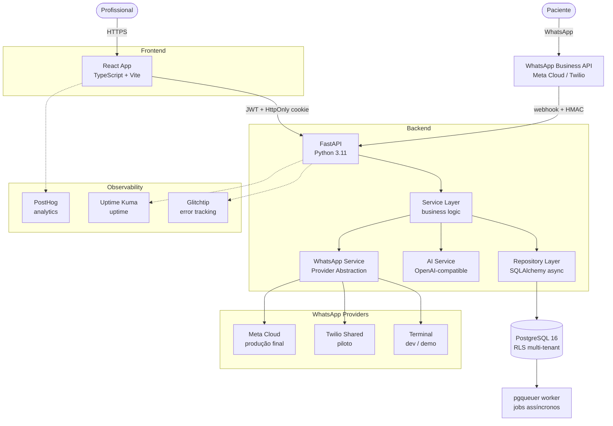

# Corelix — Agendamento Inteligente via WhatsApp

> Case study de arquitetura e engenharia.
> O código-fonte é privado por se tratar de produto comercial em desenvolvimento.
> Este repositório documenta o problema, as decisões e o processo — que é o que importa para avaliar engenharia.

---

## TL;DR

SaaS de agendamento via WhatsApp para profissionais de saúde autônomos. Monorepo com front-end React/TypeScript autoral e back-end FastAPI/PostgreSQL implementado com engenharia assistida por IA sob minha direção técnica: especificação em ADRs, **1.014 testes automatizados** (858 Python + 156 TypeScript), observabilidade em produção e integração oficial com a WhatsApp Business API como Meta Tech Provider.

---

## O Problema

Profissionais de saúde autônomos — psicólogos, nutricionistas, personal trainers, terapeutas — gerenciam a agenda manualmente pelo WhatsApp: vai-e-vem de mensagens para achar horário, remarcações perdidas no meio da conversa e no-show sem lembrete. No Brasil, o WhatsApp é _o_ canal do cliente; a solução precisa viver dentro dele, não competir com ele.

O Corelix automatiza oferta de horários, confirmação e lembretes direto na conversa, com um painel web para o profissional acompanhar sessões, clientes e receita.

**Escopo de dados:** apenas administrativos — nome, contato, histórico de sessões e valores. Nenhum dado clínico ou prontuário.

---

## Minha Atuação (e Por Que Este Case É Transparente Sobre IA)

Sou engenheiro front-end sênior com 10 anos de React/TypeScript. Neste projeto, atuei como diretor técnico de ponta a ponta:

- **Front-end React/TypeScript** — escrito por mim, incluindo o design system próprio (ver seção _Fidelidade de UI_).
- **Back-end FastAPI/PostgreSQL** — implementado com Claude Code sob minha especificação e revisão, com testes como contrato de aceitação.
- **Arquitetura, ADRs, estratégia de testes, observabilidade e credenciamento na Meta** — definidos e conduzidos por mim.

Em 2026, dirigir IA com disciplina de engenharia é parte do trabalho de um sênior. Este case documenta esse processo em vez de escondê-lo: o valor está no julgamento — o que construir, como validar, quais trade-offs aceitar — não em quem digitou cada linha.

---

## Estrutura do Monorepo

```
application/
├── apps/
│   ├── api/          # FastAPI — 9 módulos: auth, professionals, clients,
│   │                 #           agenda, reports, whatsapp, ai, jobs, core
│   └── web/          # React + TypeScript — 6 features: clients, agenda,
│                     #           reports, settings, whatsapp + auth
├── docs/
│   ├── decisions/    # 28 ADRs (Architecture Decision Records)
│   └── domains/      # Documentação de implementação por módulo
├── docker-compose.yml          # Produção (Coolify)
├── docker-compose.dev.yml      # Desenvolvimento local (PostgreSQL)
└── .github/workflows/          # CI: backend.yml + frontend.yml
```

---

## Arquitetura



### Fluxo Principal: do "oi" do paciente ao horário confirmado

1. **Paciente envia mensagem** no WhatsApp do profissional (ou no número compartilhado Corelix no piloto Twilio).
2. **Meta Cloud API / Twilio** valida a assinatura HMAC e entrega o webhook ao endpoint da API.
3. **Webhook handler** verifica a assinatura, registra o `provider_message_id` para idempotência e enfileira uma task de background — o HTTP 200 é retornado imediatamente para a Meta/Twilio.
4. **Background task** cria sua própria sessão de banco, seta o tenant via `SET LOCAL` e chama `WhatsAppService.handle_inbound_message`.
5. O service consulta o histórico da conversa, chama a **AI Service** com o contexto e obtém a resposta.
6. A resposta é enviada de volta via **provider** (Meta ou Twilio), que abstrai o protocolo HTTP específico de cada plataforma.
7. A sessão aparece no **painel web** em tempo real. O profissional pode assumir a conversa (modo handoff) ou deixar a IA continuar.
8. Quando o horário é confirmado, uma **sessão** é criada na agenda e o paciente recebe confirmação automaticamente.

---

## Decisões Registradas em ADR (Seleção)

O projeto usa Architecture Decision Records desde o início — 28 ADRs cobrem desde convenções de banco até estratégia de infra. Cada decisão inclui contexto, alternativas descartadas e consequências.

| # | Decisão | Trade-off aceito |
|---|---------|------------------|
| **ADR-001** | **Multi-tenancy: dupla barreira** — cada tenant é isolado tanto na camada de aplicação (filtro por `professional_id`) quanto no banco (PostgreSQL RLS). Uma falha em uma camada não compromete a outra. | Toda nova tabela tenant exige policy RLS manual. Sem automação — é intencional: força revisão explícita de cada tabela nova. |
| **ADR-005** | **TDD obrigatório** — o teste é escrito antes da implementação e serve como contrato: descreve o comportamento esperado antes de qualquer linha de código. Funcionalidade gerada por IA só entra com teste que a especifique. | Velocidade inicial menor; setup com PostgreSQL real em testes tem complexidade não trivial (RLS policies, roles, fixtures). |
| **ADR-014** | **Token JWT em variável de módulo** no front-end (`let _accessToken` em `api.ts`), nunca em `localStorage`, `sessionStorage` ou React state. Interceptors axios sempre fecham sobre a variável de módulo, garantindo acesso ao token corrente. | Token desaparece ao recarregar a página — cada aba faz restore via `POST /auth/refresh` com o HttpOnly cookie. Custo aceitável vs. riscos de XSS com storage persistente. |
| **ADR-016** | **Fila de requests durante refresh** — requests que recebem 401 enquanto um refresh já está em curso entram em fila de Promises e retentam com o novo token. Garante exatamente um `POST /auth/refresh` por janela de expiração, mesmo com múltiplas abas. | Complexidade não trivial para uma feature aparentemente simples; requests ficam suspensos pelos ~300 ms do refresh. |
| **ADR-019** | **Background jobs via pgqueuer** (sem Redis) — filas persistentes sobre o próprio PostgreSQL. Nenhuma infra adicional necessária no MVP. | PostgreSQL não é especializado em filas; degradaria com volume de milhões de jobs/dia — irrelevante para o estágio atual. |
| **ADR-028** | **Abstração de provider WhatsApp** — interface `WhatsAppProvider` (ABC) com três implementações intercambiáveis: `TerminalProvider` (dev/demo, stdin/stdout), `TwilioSharedAccountProvider` (piloto, número único Corelix) e `MetaCloudProvider` (produção final, número próprio por profissional via Embedded Signup). Provider resolvido por factory em runtime. | Três implementações em vez de uma (~800 linhas a mais). No piloto Twilio, pacientes veem "Corelix" como remetente (não o profissional). Migração depende de aprovação externa da Meta como Tech Provider. |

---

## Estratégia de Qualidade

**1.014 testes automatizados** distribuídos em:

| Camada | Quantidade | Tecnologia |
|--------|-----------|------------|
| Backend — schemas e validação Pydantic | ~110 | pytest + pytest-asyncio |
| Backend — ORM / models | ~50 | pytest + PostgreSQL real |
| Backend — repositórios (integração, PostgreSQL real) | ~170 | pytest + asyncpg |
| Backend — services (unitários, dependências mockadas) | ~130 | pytest + unittest.mock |
| Backend — routers (HTTP, httpx AsyncClient + PostgreSQL real) | ~170 | pytest + httpx |
| Backend — providers WhatsApp / webhooks / jobs | ~110 | pytest + respx (mock HTTP) |
| Backend — core / segurança / observabilidade | ~30 | pytest |
| **Subtotal backend** | **858** | pytest · ruff · mypy strict |
| Frontend — componentes e hooks (jsdom + MSW) | ~95 | Vitest + Testing Library |
| Frontend — a11y (WCAG 2.1 AA estrutural) | ~35 | jest-axe (0 violations) |
| Frontend — observabilidade (Sentry + PostHog) | ~26 | Vitest |
| **Subtotal frontend** | **156** | Vitest · TypeScript strict · ESLint |
| **Total** | **1.014** | CI: GitHub Actions |

**A regra do projeto:** funcionalidade gerada por IA só entra com teste que a especifique primeiro (Red → Green → Refactor). O teste é o contrato entre a minha intenção e a implementação da IA.

**CI** roda a suíte completa a cada push para `develop` e a cada PR para `main`:
- Backend: PostgreSQL 16-alpine como service Docker, `pytest` + `mypy --strict` + `ruff`
- Frontend: `vitest run --coverage` com threshold de 80% lines/functions e 75% branches, `tsc --noEmit` + `eslint`

---

## Engenharia Assistida por IA — o Processo

O fluxo que uso com Claude Code neste projeto:

**1. Especificação primeiro.** O que construir vira spec escrita antes de qualquer código. Para decisões estruturais, um ADR com contexto, alternativas descartadas e consequências.

**2. Diretrizes persistentes.** Regras de segurança (nunca `session.commit()` no service, sempre `exclude_unset=True` em PATCH, RLS obrigatório em tabelas tenant, tipo UUID para PKs) ficam em um arquivo `.rules` no repositório. O agente as carrega em todo contexto — sem precisar repetir nos prompts.

**3. Implementação dirigida.** A IA implementa contra a spec; eu reviso o diff como revisaria o PR de um dev do time. O critério de aceitação é o teste passar — não o código "parecer correto".

**4. Testes como contrato.** Nada entra sem teste passando que descreva o comportamento esperado. Isso é especialmente importante com IA: o teste é o único artefato que eu escrevi antes de ver a implementação.

**5. Observabilidade fecha o ciclo.** Glitchtip (error tracking), PostHog (analytics de produto) e Uptime Kuma (uptime) — porque código que a IA escreveu e eu revisei ainda precisa provar que funciona em produção.

**Um trecho real do processo.** Ao implementar o isolamento RLS em testes, descobrimos que o usuário `postgres` tem `BYPASSRLS` nativo no PostgreSQL — o que tornava os testes de isolamento inúteis (sempre passavam, mesmo sem RLS funcionar). A solução foi criar um role `test_rls_user` (sem `BYPASSRLS`) e usar `SET LOCAL ROLE` antes de cada teste de isolamento. Esse tipo de descoberta — que só aparece quando você realmente testa contra o banco real — virou o ADR-021 e está hoje registrado tanto nos ADRs quanto nos gotchas do projeto.

---

## Um Desafio Interessante: Fidelidade de UI

O produto nasceu com uma identidade visual clara: dark glass-morphism. Backgrounds em `hsl(225, 20%, 10%)`, superfícies em `rgba(255,255,255, 0.05)`, bordas translúcidas, purple glow como cor primária. Os wireframes entregues como referência já tinham essa estética implementada em HTML/CSS puro.

O desafio ao implementar em React: **shadcn/ui** resolve muito bem a camada de comportamento (ARIA roles, navegação por teclado, gerenciamento de foco em Dialogs e Selects) — mas os componentes chegam com pressupostos visuais que brigam com o glass. Usar shadcn no padrão = abrir mão da identidade. Construir tudo do zero = meses de work sem entregar funcionalidade.

**A resolução foi uma estratégia de três camadas:**

```
Camada visual  →  src/index.css          CSS custom properties para todos os tokens
                                          (.glass-card, --bg-surface, --border-purple...)
Camada lógica  →  Radix UI primitivos    Dialog, Select, Checkbox — apenas ARIA + interação
Camada layout  →  Tailwind v4            flex, grid, gap, w-full — apenas estrutura
```

Os componentes Radix são essencialmente invisíveis — entregam o plumbing de acessibilidade sem impor visual. Os tokens CSS em `index.css` definem toda a aparência. O resultado: identidade dark glass preservada, WCAG 2.1 AA atingível.

**Uma consequência prática desse aprendizado** apareceu nos testes de acessibilidade: o `FormControl` do shadcn renderiza como `<div>`, fazendo o `<label htmlFor>` apontar para um elemento não-labelável — violação WCAG. A correção foi usar o primitivo `Slot` do Radix UI para que o `FormControl` clone o `id` para o filho real (o `<input>`). Esse padrão está hoje codificado no componente `form.tsx` do projeto.

---

## Stack

| Camada | Tecnologias |
|--------|-------------|
| **Front-end** | React 18.3 · TypeScript 5.6 · Vite 5.4 · Tailwind CSS 4.2 · Radix UI (headless) · TanStack Query 5 · Zustand 5 · React Hook Form 7 · Zod 4 · react-big-calendar · date-fns 4 + date-fns-tz · Sonner · axios · lucide-react |
| **Back-end** | Python 3.11 · FastAPI 0.109 · SQLAlchemy 2.0 async · Alembic 1.13 · asyncpg 0.29 · Pydantic 2.5 · pgqueuer 0.10 · python-jose · passlib + bcrypt · cryptography (Fernet AES) · Twilio SDK · httpx |
| **Dados** | PostgreSQL 16 · Row Level Security (multi-tenant) · NUMERIC(10,2) para moeda · UUID PKs · TIMESTAMPTZ em todas as datas |
| **Integrações** | WhatsApp Business API (Meta Cloud API como Tech Provider) · Twilio WhatsApp (piloto shared) · AI via API OpenAI-compatible (provider configurável via env) |
| **Infra & CI** | GitHub Actions (CI/CD) · Docker Compose · Coolify self-hosted · VPS Hostinger KVM 2 (São Paulo, LGPD) · Poetry (Python deps) |
| **Observabilidade** | Glitchtip (error tracking + APM, self-hosted) · PostHog Cloud (analytics, free tier) · Uptime Kuma (uptime, self-hosted) · sentry-sdk + @sentry/react |
| **Testes** | pytest + pytest-asyncio + httpx + factory-boy + respx (backend) · Vitest + Testing Library + MSW + jest-axe (frontend) · mypy strict + ruff + ESLint (static analysis) |

---

## WhatsApp: Estratégia de Provider (ADR-028 em Detalhe)

A integração com WhatsApp foi o maior desafio arquitetural do projeto — não por complexidade técnica, mas por restrições de mercado.

**O problema:** tanto a Meta quanto a Twilio exigem aprovação como Tech Provider para o modelo multi-tenant self-serve (cada profissional com seu número). Essa aprovação tem prazo indefinido. O produto precisava chegar ao mercado antes da aprovação.

**A solução:** uma camada de abstração com três implementações que permitem go-to-market imediato sem sacrificar a arquitetura final.

```
WhatsAppProvider (ABC)
├── TerminalProvider       — stdin/stdout para dev, demos e testes
├── TwilioSharedProvider   — 1 número Corelix ↔ N profissionais (piloto maio/2026)
└── MetaCloudProvider      — 1 número por profissional via Embedded Signup (pós-aprovação)
```

A seleção do provider acontece no `WhatsAppProviderFactory` em runtime: flag de env força Terminal em desenvolvimento, registro do profissional no banco determina Meta vs. Twilio em produção.

**Idempotência:** cada mensagem recebida tem um `provider_message_id` único. O webhook handler persiste esse ID antes de processar — mensagens duplicadas (retry do Meta/Twilio em falha de rede) são descartadas silenciosamente.

**Segurança:** tokens de acesso por profissional são armazenados criptografados com Fernet (AES-128-CBC + HMAC-SHA256). Descriptografados apenas no momento de chamar o provider. Webhooks validam assinatura HMAC antes de qualquer processamento (HMAC-SHA256 para Meta, HMAC-SHA1 para Twilio).

---

## Status

Produto próprio em desenvolvimento ativo · código 100% implementado e testado (858 testes Python + 156 TypeScript, todos verdes) · aguardando provisionamento de infra para primeiro deploy em produção.

**Próximos passos:**
- Deploy inicial no Hostinger KVM 2 via Coolify (configuração de serviços, variáveis de produção, migration inicial)
- Onboarding de primeiros profissionais no piloto Twilio Shared
- Embedded Signup (conectar número próprio por profissional) — condicionado à aprovação Meta Tech Provider

---

## Screenshots

> _Imagens em [`/assets`](./assets/) — tiradas com dados fictícios._

| # | Tela | Descrição |
|---|------|-----------|
| 1 | **Dashboard** | KPI cards (sessões hoje, receita do mês, clientes ativos) + lista de sessões do dia com avatar, status badge e client_name |
| 2 | **Agenda — visão semana** | CSS Grid com sessões posicionadas por horário; click em slot abre formulário de nova sessão |
| 3 | **Agenda — formulário de sessão** | Modal com React Hook Form + Zod; campos de data/hora com timezone; PATCH semântico |
| 4 | **Clientes** | Tabela com busca debounced, skeleton de carregamento, badge de status ativo/inativo e confirmação via AlertDialog |
| 5 | **WhatsApp — conversas** | Lista de conversas com status (ativa/resolvida/aguardando profissional) + thread de mensagens com badge "🤖 IA" vs "profissional" |
| 6 | **Reports** | Filtro por período, cards de receita/inadimplência, tabela de faturamento por cliente |

---

## Sobre Este Repositório

Este case study é parte do meu portfólio público. O código-fonte permanece privado por tratar-se de produto comercial em desenvolvimento. O que está documentado aqui — a arquitetura, as 28 decisões de engenharia, a estratégia de testes e o processo de trabalho com IA — representa o julgamento técnico que considero mais valioso para avaliar.

---

<p align="center">
  Case study por <strong>Leandro M. Silva</strong><br>
  <a href="https://leandromsilva.dev.br">leandromsilva.dev.br</a> · <a href="https://linkedin.com/in/leandromsilva">LinkedIn</a>
</p>
